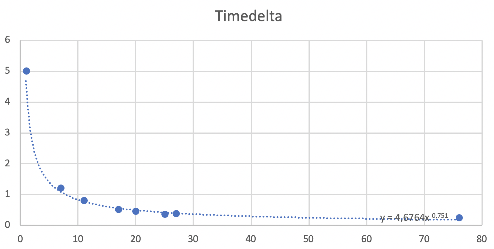

Loco Sound API
==============

.. contents::
	:local:

Architecture
------------

The architecture of `loco sound` is wrapped primary around a main loop
of a `pygame` application.

Startup
~~~~~~~

During startup we will try

Main Loop
~~~~~~~~~

Sound Packet
------------

Speed Curve
~~~~~~~~~~~

	Measured time between cylinder sound time delta and `Z21` speed steps.

Z21
---

`Z21` is a digital platform to control miniature train by the manufacture
`Roco/Fleischmann`.

The LAN specification of the Z21 can be found `here <https://www.z21.eu/media/Kwc_Basic_DownloadTag_Component/root-en-main_47-1652-959-downloadTag-download/default/d559b9cf/1558675126/z21-lan-protokoll-en.pdf>`_.

Sources
-------

``loco_sound.loco``
~~~~~~~~~~~~~~~~~~~

The `loco` package stores the state of each registered locomotive.
For registration of a locomotive, see :func:`loco_sound.loco.LocoCollector.add_locos`

.. automodule:: loco_sound.loco
	:members:

``loco_sound.z21``
~~~~~~~~~~~~~~~~~~

The `z21` package contains the network communication to the Z21.

.. automodule:: loco_sound.z21
	:members:
